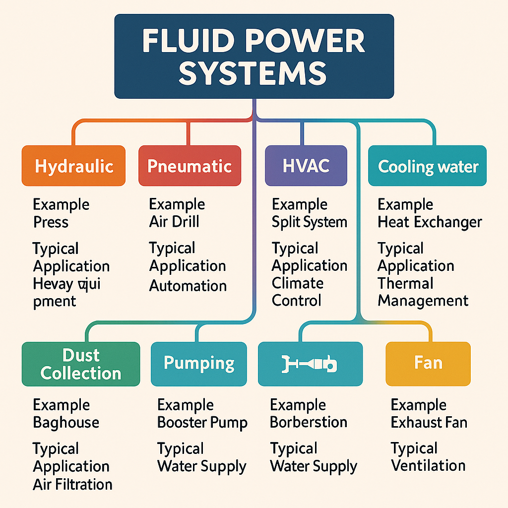

# Chapter 1: Introduction to Fluid Power Systems and AI

- Overview of fluid power systems: HVAC, compressed air, hydraulics, etc.
- Basics of fluids (water, oil, air) and system components
- Introduction to AI, controls, and data collection in modern systems
- **AI & Tech Focus:** How AI uses historical data to predict issues and optimize labor
- **Lab:** Explore a fluid power system and a demo AI dashboard (e.g., system monitoring app)

## 1.1 Overview of Fluid Power Systems

Fluid power systems form the backbone of modern industrial operations, transportation, and building management. These systems harness the properties of fluids to transmit power, control movement, and maintain optimal environments across diverse applications. Unlike traditional mechanical systems that rely on solid linkages, fluid power systems use liquids or gases to transmit force and energy efficiently over distances.

The main categories of fluid power systems include:

- **Hydraulic systems** - Using incompressible liquids (typically oil) to transmit force
- **Pneumatic systems** - Employing compressed air to generate mechanical motion
- **HVAC systems** - Managing air quality, temperature, and humidity in buildings
- **Vacuum systems** - Creating pressure differentials for material handling and processing
- **Cooling water systems** - Transferring heat away from equipment and processes
- **Dust collection systems** - Removing particulates from air for safety and quality control
- **Pumping systems** - Moving liquids through pipes for various applications
- **Fan systems** - Circulating air for ventilation, cooling, and process requirements

> **FIGURE 1.1: Fluid Power Systems Taxonomy**
> *A hierarchical diagram showing the classification of fluid power systems with examples and typical applications for each category. The diagram should show branches for hydraulic, pneumatic, HVAC, vacuum, cooling water, dust collection, pumping, and fan systems.*

### 1.1.1 Hydraulic Systems

Hydraulic systems utilize the power of pressurized liquids to perform work. These systems excel at delivering high force with precise control, making them ideal for heavy machinery and equipment. Key applications include:

- Construction equipment (excavators, bulldozers)
- Manufacturing machinery (presses, injection molding)
- Automotive systems (brakes, power steering)
- Aircraft control surfaces
- Industrial lifting and positioning equipment

### 1.1.2 Pneumatic Systems

Pneumatic systems use compressed air to generate mechanical motion. While they typically provide less force than hydraulic systems, they offer cleaner operation, simpler maintenance, and faster cycling speeds. Common applications include:

- Assembly line automation
- Tool operation (nail guns, impact wrenches)
- Conveying systems
- Packaging equipment
- Dental and medical instruments

### 1.1.3 HVAC Systems

Heating, Ventilation, and Air Conditioning (HVAC) systems control temperature, humidity, and air quality in buildings. These systems combine fluid principles with thermodynamics to maintain comfortable and safe indoor environments. HVAC systems typically include:

- Air handlers and ductwork
- Chillers and cooling towers
- Pumps and compressors
- Control systems and thermostats
- Filtration systems

### 1.1.4 Additional Fluid Power Systems

Other important fluid power systems include:

- **Vacuum systems** for material handling, packaging, and specialized industrial processes
- **Cooling water systems** for temperature control in industrial equipment
- **Dust collection systems** for maintaining air quality and worker safety
- **Pumping systems** for water supply, wastewater, and industrial fluids
- **Fan systems** for ventilation, cooling, and process requirements

## 1.2 Basics of Fluids and System Components

### 1.2.1 Properties of Fluids

The effectiveness of fluid power systems depends on the physical properties of the fluids they employ. The three primary working fluids—water, oil, and air—each offer distinct advantages for different applications.

> **TABLE 1.1: Comparison of Common Working Fluids**
> 
> | Property | Water | Hydraulic Oil | Air |
> |----------|-------|--------------|-----|
> | Compressibility | Very low | Low | High |
> | Viscosity | Low | Medium to high | Very low |
> | Temperature range | Limited by freezing/boiling | Wide (-20°F to 180°F+) | Very wide |
> | Lubrication | Poor | Excellent | Poor |
> | Environmental impact | Minimal | Potential concern | Minimal |
> | Typical system pressure | 30-300 psi | 500-5,000+ psi | 80-125 psi |
> | Cost | Very low | Medium to high | Low |

#### Key Fluid Properties:

- **Viscosity**: Resistance to flow, affecting friction losses and power transmission
- **Density**: Mass per unit volume, influencing inertial effects and pressure generation
- **Compressibility**: Volume change under pressure, determining system stiffness
- **Thermal properties**: Heat capacity and conductivity, affecting temperature management

### 1.2.2 Fundamental Principles

Fluid power systems operate on several core principles:

- **Pascal's Law**: Pressure applied to an enclosed fluid is transmitted equally in all directions
- **Bernoulli's Principle**: As fluid velocity increases, pressure decreases
- **Conservation of Energy**: Energy cannot be created or destroyed, only converted between forms
- **Flow Continuity**: In a closed system, the volume flow rate is constant throughout

> **FIGURE 1.2: Pascal's Law Demonstration**
> *An illustration showing how pressure applied to a confined fluid is transmitted equally in all directions, with a simple hydraulic system diagram demonstrating force multiplication.*

### 1.2.3 Core System Components

Regardless of the specific application, most fluid power systems share several fundamental components:

#### Power Generation Components

- **Pumps**: Convert mechanical energy to fluid energy by moving fluid and creating pressure
  - Positive displacement (gear, vane, piston)
  - Dynamic (centrifugal, axial flow)
- **Compressors**: Increase the pressure of gases for pneumatic systems
  - Reciprocating
  - Rotary screw
  - Centrifugal

#### Control Components

- **Valves**: Direct and regulate fluid flow and pressure
  - Directional control valves
  - Pressure control valves
  - Flow control valves
- **Actuators**: Convert fluid energy to mechanical motion
  - Cylinders (linear motion)
  - Motors (rotary motion)
  - Turbines (rotary motion from flow)

#### Conditioning Components

- **Filters**: Remove contaminants from fluids
- **Regulators**: Maintain constant pressure regardless of flow
- **Heat exchangers**: Transfer heat to or from the fluid
- **Accumulators**: Store energy and dampen pressure fluctuations
- **Reservoirs**: Store fluid and allow for thermal expansion/contraction

#### Transmission Components

- **Pipes and tubing**: Conduct fluid between system components
- **Hoses**: Flexible fluid conductors for moving components
- **Fittings and connectors**: Join system components
- **Seals**: Prevent fluid leakage

> **FIGURE 1.3: Basic Fluid Power System Layout**
> *A schematic diagram showing the interconnection of core components in a typical fluid power system, including power generation, control, conditioning, and transmission elements.*

## 1.3 Introduction to AI, Controls, and Data Collection

Modern fluid power systems have evolved beyond purely mechanical operations to incorporate advanced control systems, sensors, and artificial intelligence. This integration creates intelligent systems capable of self-monitoring, optimization, and predictive capabilities.

### 1.3.1 Evolution of Control Systems

The development of fluid power control systems has progressed through several generations:

1. **Manual controls**: Direct human operation of valves and switches
2. **Electromechanical controls**: Relays and simple circuits automating basic functions
3. **Programmable Logic Controllers (PLCs)**: Dedicated industrial computers for process control
4. **Distributed Control Systems (DCS)**: Networked controllers managing complex processes
5. **Smart control systems**: Integration of AI, IoT, and advanced analytics

### 1.3.2 Modern Control System Components

Today's fluid power control systems typically include:

- **Controllers**: Central processing units executing control logic
  - PLCs
  - Microcontrollers
  - Industrial PCs
  - Edge computing devices
- **Human-Machine Interfaces (HMI)**: Touchscreens, displays, and control panels
- **Input devices**: Buttons, switches, and remote controls
- **Sensors and transducers**: Converting physical parameters to electrical signals
- **Actuators**: Converting electrical signals to physical actions
- **Communication networks**: Connecting system components
  - Fieldbus protocols
  - Industrial Ethernet
  - Wireless networks (Wi-Fi, Bluetooth, Zigbee)

> **FIGURE 1.4: Control System Hierarchy**
> *A pyramid diagram showing the hierarchy of modern control systems, from field devices (sensors, actuators) at the bottom to enterprise systems at the top, with control, supervision, and management layers in between.*

### 1.3.3 Industrial Data Collection

The foundation of AI-enhanced fluid power systems is comprehensive data collection. Modern systems gather extensive operational data through various means:

#### Sensor Types

- **Pressure sensors**: Monitoring fluid pressure at critical points
- **Flow sensors**: Measuring fluid movement rates
- **Temperature sensors**: Tracking thermal conditions
- **Level sensors**: Determining fluid quantities in reservoirs
- **Vibration sensors**: Detecting mechanical issues
- **Power monitors**: Measuring electrical consumption
- **Proximity sensors**: Tracking component positions
- **Acoustic sensors**: Identifying unusual sounds (leaks, cavitation)

#### Data Acquisition Systems

- **Data loggers**: Recording measurements over time
- **Analog-to-digital converters**: Transforming sensor outputs to digital values
- **Signal conditioners**: Preparing sensor outputs for processing
- **Gateways**: Connecting sensors to networks
- **Edge devices**: Processing data close to its source

#### Data Management

- **Databases**: Storing historical and real-time information
- **Historians**: Archiving time-series data
- **Cloud storage**: Providing scalable data repositories
- **Data lakes**: Maintaining raw data for future analysis

> **TABLE 1.2: Common Sensor Types in Fluid Power Systems**
> 
> | Sensor Type | Measurement | Typical Applications | Output Type |
> |-------------|-------------|---------------------|------------|
> | Pressure transducer | System pressure | Pump monitoring, leak detection | Analog/digital |
> | Flow meter | Fluid flow rate | Efficiency monitoring, process control | Pulse/analog |
> | RTD/Thermocouple | Temperature | Overheating detection, process control | Analog |
> | Vibration sensor | Mechanical vibration | Bearing wear, imbalance detection | Analog/digital |
> | Current transformer | Electrical current | Motor health, power consumption | Analog |
> | Ultrasonic level sensor | Fluid level | Tank monitoring, refill scheduling | Analog/digital |
> | Humidity sensor | Moisture content | HVAC control, air quality | Analog/digital |
> | Particulate sensor | Air quality | Filter monitoring, environmental control | Digital |

## 1.4 AI & Tech Focus: Using Historical Data for Prediction and Optimization

The integration of artificial intelligence with fluid power systems represents a transformative advancement in system management. AI technologies enable systems to learn from their operational history, predict future conditions, and optimize performance automatically.

### 1.4.1 The AI Revolution in Fluid Power

Artificial intelligence brings several capabilities to fluid power systems:

- **Pattern recognition**: Identifying relationships between system variables
- **Anomaly detection**: Recognizing unusual conditions that may indicate problems
- **Predictive analysis**: Forecasting future behavior based on historical patterns
- **Optimization**: Finding the best operating parameters for specific goals
- **Natural language processing**: Enabling voice commands and conversational interfaces
- **Computer vision**: Inspecting components through image analysis

### 1.4.2 Types of AI in Industrial Applications

Several AI approaches are commonly used in fluid power systems:

- **Machine Learning (ML)**: Algorithms that improve through experience
  - Supervised learning (using labeled examples)
  - Unsupervised learning (finding patterns without labels)
  - Reinforcement learning (optimizing through trial and error)
- **Neural Networks**: Computing systems inspired by biological neural networks
  - Deep learning for complex pattern recognition
  - Convolutional neural networks for image processing
- **Expert Systems**: Rule-based systems encoding human expertise
- **Fuzzy Logic**: Handling imprecise information through degrees of truth

> **FIGURE 1.5: Machine Learning Process**
> *A flowchart showing the process of developing and deploying machine learning for fluid power systems, including data collection, preprocessing, model training, validation, deployment, and continuous improvement.*

### 1.4.3 Historical Data Analysis

Historical data serves as the foundation for AI-driven fluid power management:

#### Data Types Leveraged

- **Time-series operational data**: System pressures, flows, temperatures over time
- **Maintenance records**: Repair history, component replacements, failures
- **Energy consumption patterns**: Power usage under various conditions
- **Environmental data**: Ambient conditions affecting system performance
- **Production data**: System output and quality metrics

#### Analysis Techniques

- **Trend analysis**: Identifying long-term patterns and gradual changes
- **Correlation analysis**: Finding relationships between different parameters
- **Frequency analysis**: Examining cyclical patterns and oscillations
- **Root cause analysis**: Tracing problems to their source
- **Failure mode analysis**: Understanding how and why components fail

### 1.4.4 Predictive Maintenance

One of the most valuable applications of AI in fluid power is predictive maintenance—anticipating equipment failures before they occur:

#### Benefits of Predictive Maintenance

- Reduced unplanned downtime (typically 30-50% reduction)
- Extended equipment life (10-40% increase)
- Lower maintenance costs (25-30% savings)
- Improved safety through prevention of catastrophic failures
- Optimized labor allocation by scheduling maintenance proactively

#### Prediction Methods

- **Condition-based monitoring**: Tracking parameters against thresholds
- **Remaining useful life (RUL) estimation**: Predicting component lifespans
- **Failure prediction models**: Calculating probability of imminent failures
- **Digital twins**: Virtual replicas of physical systems for simulation

> **FIGURE 1.6: Predictive Maintenance Comparison**
> *A comparison chart showing the differences between reactive, preventive, and predictive maintenance approaches, highlighting the cost, downtime, and resource utilization advantages of predictive maintenance.*

### 1.4.5 Labor Optimization

AI significantly enhances labor efficiency in fluid power system management:

#### Automated Decision Support

- **Maintenance prioritization**: Ranking tasks by urgency and impact
- **Resource allocation**: Assigning the right personnel and parts
- **Procedure optimization**: Streamlining maintenance workflows
- **Knowledge capture**: Preserving expertise from experienced technicians

#### Field Service Enhancement

- **Remote diagnostics**: Troubleshooting without on-site visits
- **Augmented reality guidance**: Providing visual instructions for repairs
- **Predictive dispatch**: Sending technicians before failures occur
- **Inventory optimization**: Ensuring the right parts are available

#### Results of AI-Enhanced Labor Management

- 20-35% reduction in maintenance labor hours
- 40-60% decrease in emergency repairs
- 15-25% improvement in first-time fix rates
- 30-45% reduction in mean time to repair (MTTR)

## 1.5 Laboratory Exercise: Exploring Fluid Power Systems and AI Dashboards

### 1.5.1 Lab Overview

This introductory laboratory exercise provides hands-on experience with basic fluid power components and introduces students to modern AI monitoring systems.

**Objectives:**
- Identify and explain the function of key fluid power components
- Understand the relationship between pressure, flow, and system performance
- Navigate and interpret data from an AI monitoring dashboard
- Experience how historical data can predict system behavior

**Equipment Required:**
- Fluid power demonstration unit (hydraulic or pneumatic)
- Pressure and flow sensors with data acquisition system
- Computer workstation with AI dashboard software
- Safety equipment (safety glasses, gloves)

### 1.5.2 Part 1: Fluid Power System Exploration

#### Procedure

1. Identify all major components on the demonstration unit:
   - Power source (pump or compressor)
   - Actuators (cylinders or motors)
   - Control valves
   - Pressure regulation devices
   - Filtration components
   - Fluid reservoir or receiver

2. With instructor guidance, operate the system through basic cycles:
   - Observe pressure gauge readings during operation
   - Note the relationship between valve positions and actuator movement
   - Measure flow rates at different pressure settings
   - Document the system's response to different loads

3. Introduce and resolve system faults:
   - Partially block a filter to simulate contamination
   - Restrict flow to create pressure changes
   - Introduce a controlled leak (if system design allows)
   - Record system behavior under each fault condition

> **FIGURE 1.7: Fluid Power System Diagram with Measurement Points**
> *A labeled diagram of the laboratory fluid power system showing key components and indicating where pressure, flow, temperature, and other measurements are taken. This serves as a reference for students during the lab exercise.*

### 1.5.3 Part 2: AI Dashboard Exploration

#### Procedure

1. Access the monitoring dashboard on the workstation:
   - Log in using provided credentials
   - Identify the main sections of the interface
   - Locate real-time data displays
   - Find historical data visualizations

2. Connect the demonstration unit to the monitoring system:
   - Verify sensors are communicating properly
   - Observe real-time data collection
   - Compare dashboard readings to physical gauges

3. Explore historical data features:
   - Examine trend graphs from previous operations
   - Review statistical summaries of system performance
   - Identify patterns in operational data

4. Investigate predictive capabilities:
   - Review examples of fault predictions
   - Examine how the system identifies anomalies
   - Understand confidence ratings for predictions
   - Test the system's response to deliberate faults

5. Optimization exploration:
   - Use the dashboard to identify efficiency improvements
   - Review energy consumption metrics
   - Explore maintenance scheduling recommendations

> **FIGURE 1.8: Sample AI Dashboard Layout**
> *A screenshot of the AI monitoring dashboard showing key sections: real-time monitoring, historical trends, predictive alerts, and system optimization recommendations. Areas should be clearly labeled to guide students.*

### 1.5.4 Lab Report Requirements

Students should prepare a lab report including:

1. Sketches and descriptions of the fluid power system components
2. Data tables showing pressure, flow, and temperature measurements
3. Graphs comparing system performance under normal and fault conditions
4. Screenshots of relevant dashboard displays with explanations
5. Analysis of how the AI system used historical data to predict issues
6. Discussion of potential labor and maintenance optimization opportunities
7. Reflection on the benefits and limitations of AI-enhanced fluid power systems

## Summary

This chapter has introduced the fundamental concepts of fluid power systems and their integration with artificial intelligence. We've explored the various types of fluid power systems, including hydraulic, pneumatic, HVAC, and other applications, and examined their core components and operating principles. The introduction to control systems, data collection, and AI technologies has highlighted how modern fluid power systems are evolving beyond purely mechanical operations to become intelligent, self-monitoring systems.

The AI & Tech Focus section demonstrated how historical data analysis enables predictive maintenance, failure prevention, and labor optimization. These capabilities represent a significant advancement in system management, offering improved reliability, efficiency, and cost-effectiveness.

The laboratory exercise provided hands-on experience with both physical fluid power components and AI monitoring systems, bridging the gap between traditional mechanical knowledge and cutting-edge digital technologies. This practical exposure is essential for developing the skills needed in today's technologically advanced industrial environment.

In the next chapter, we will build on these foundations to explore system components and smart controls in greater detail, examining how modern sensors, controllers, and AI systems work together to create responsive, efficient fluid power systems.

## Key Terms

- Fluid power
- Hydraulic system
- Pneumatic system
- HVAC
- Pascal's Law
- Bernoulli's Principle
- Actuator
- Valve
- Pump
- Compressor
- PLC (Programmable Logic Controller)
- Sensor
- Data acquisition
- Artificial intelligence (AI)
- Machine learning
- Predictive maintenance
- Historical data analysis
- Anomaly detection
- Optimization
- Digital twin

## Review Questions

1. Explain the difference between hydraulic and pneumatic fluid power systems. What are the advantages and disadvantages of each?

2. Describe how Pascal's Law applies to fluid power systems and how it enables force multiplication.

3. List five key components found in most fluid power systems and explain their functions.

4. How has the evolution of control systems changed fluid power management over time?

5. What types of sensors are commonly used in modern fluid power systems, and what parameters do they measure?

6. Explain how AI uses historical data to predict potential system failures before they occur.

7. Calculate the force output of a hydraulic cylinder with a 3-inch bore diameter operating at 1,500 psi.

8. Compare and contrast reactive maintenance, preventive maintenance, and predictive maintenance approaches.

9. Describe three ways that AI-enhanced systems can optimize labor utilization in fluid power maintenance.

10. How might a technician use an AI dashboard to improve the efficiency of their daily work?